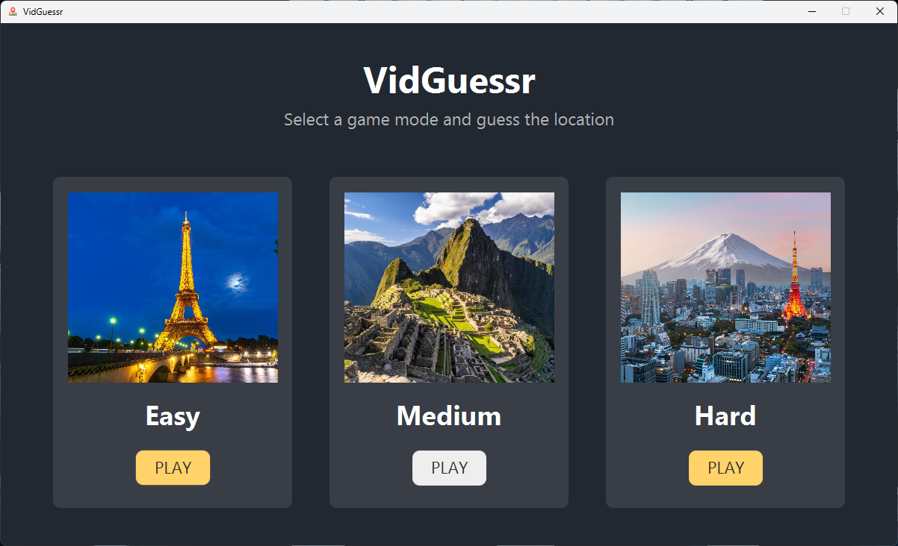
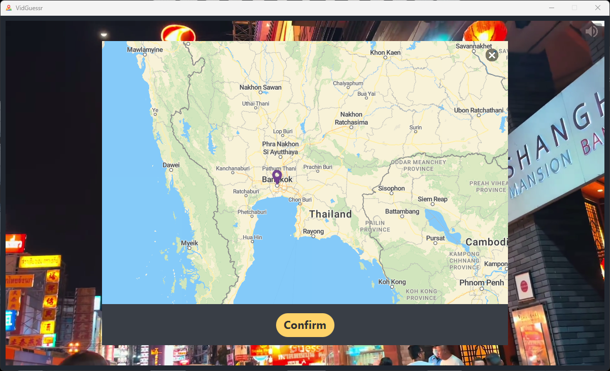
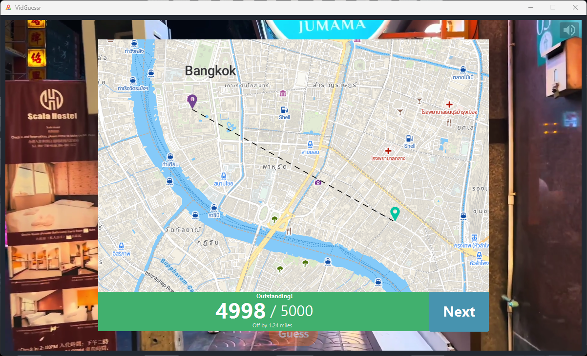
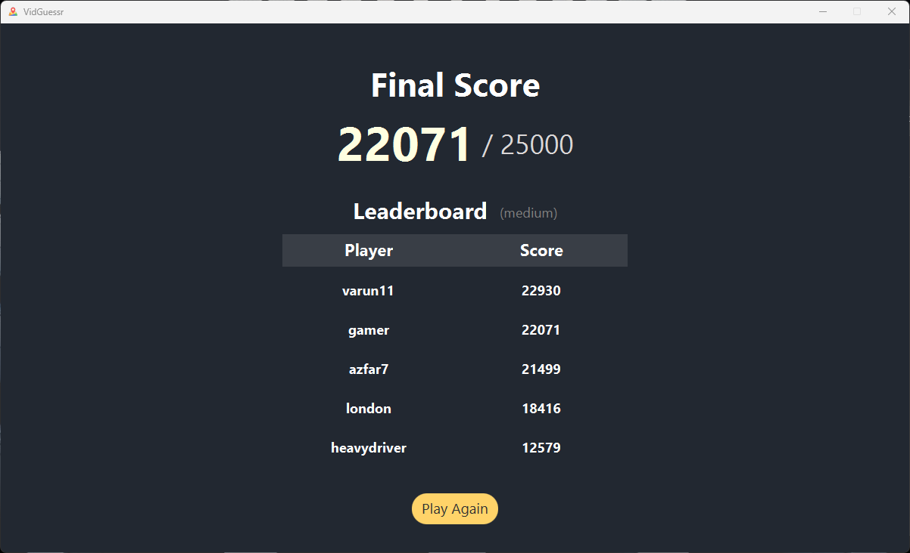
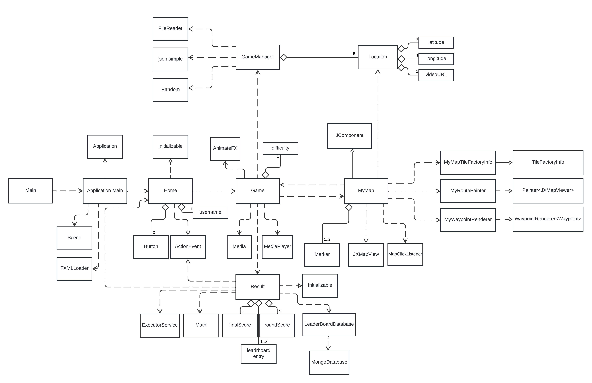

# VidGuessr

This is a location guessing game. The player will be shown a video. The player has to determine the location shown in the video. Once the player is ready to guess the location, they can click a button to show a world map. The player can drop a pin on the map. This will be their guessed location. The player will get points based on how far their guess is from the original location. A game will have 5 rounds. The videos and locations will be randomly selected by the game. The player can score at most 25000 points (5000 each round).

---

### Home Screen

 

### Video Player

 

### Map View

 

### Round Result

 

### Final Result and Leaderboard

 

### UML Diagram

